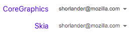
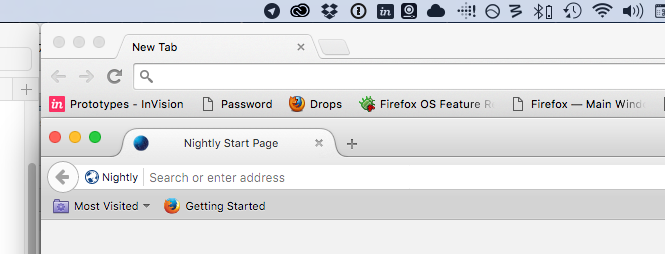
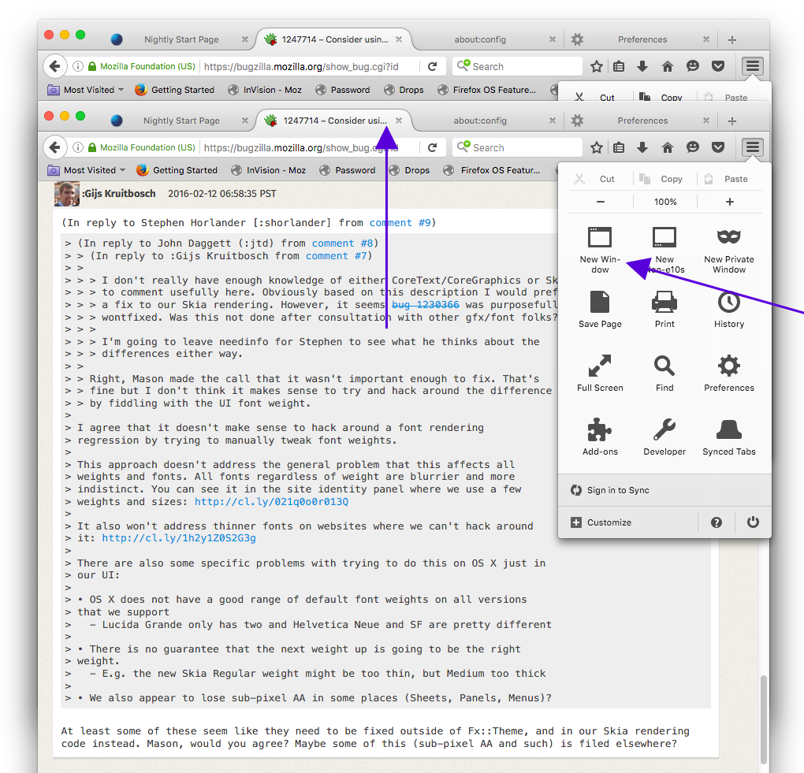

# Skia

* [Bug 1247714 - Consider using a thicker font (larger font-weight) on OS X to compensate for rendering changes caused by skia switch](https://bugzilla.mozilla.org/show_bug.cgi?id=1247714)
* [Bug 1230366 - Skia Text is thin on OS X](https://bugzilla.mozilla.org/show_bug.cgi?id=1230366)
* [Issue 541846: Font rendering is lighter than Safari / Firefox on OS X El Capitan](https://code.google.com/p/chromium/issues/detail?id=541846)

[Bug 1247714: Comment 11](https://bugzilla.mozilla.org/show_bug.cgi?id=1247714#c11)

>I also don't think that without a big rewrite of Skia internals, we'd be able to fix it. With CG, we use OS X APIs for every call to render text. CG handles all the gamma and blending of the text with the background correctly for us, which is great. However, Skia tries to not rely on CG very much. It renders each glyph once with white on black, and tries to correct the gamma such that the glyph will work in all scenarios, and caches that. It's not ideal, but overall as a whole, Skia is up to 30% faster at rendering.

>I do think that one of the consequences of moving to Skia will be that the UI looks too thin / fragile for many users not on a retina display. It's not the best solution, but I'm not against it. We already set fonts/UI to look "good" for the user, they were just dependent on how OS X rendered the font. I agree we're definitely losing the purity / some native look feel here. However, the user won't care we didn't fiddle with the fonts because we render them differently, they'll care that the UI is harder to read. I think this bug should be to just make it easier for the user here. But I'm not a UI designer, so I would be very happy to be wrong here :).

## Examples

---

[Bug 1247714: Comment 15](https://bugzilla.mozilla.org/show_bug.cgi?id=1247714#c15)

> Changing the font-weight to 400 with Skia rendering produces roughly the same visual weight as it currently does unmodified with CG (CG behind, Skia in front): http://cl.ly/3D1Q3A120e0v/o

> But it does have some undesirable side-effects (see purple arrows):
- The character width and/or tracking are wider creating overflow issues
- Copy and Paste in the menu seem heavier than Cut for some reason

